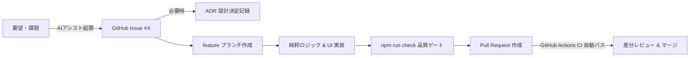

# 🚀 Tauri + React + TypeScript AI駆動開発ハーネステンプレート

**Tauri v2 + React 18 (TypeScript Strict) + Vite + Tailwind CSS** で構築された、高品質デスクトップ & Web 両対応アプリケーションのスターターテンプレートです。

AI コーディングエージェント（Antigravity, Claude, Copilot 等）と人間がペアプログラミングを行う際に、**「コンテキストドリフト・仕様破壊ゼロ・実務標準の GitHub Flow」** を実現するための開発ハーネスがあらかじめ組み込まれています。

---

## ✨ 主な特徴

- 🤖 **AIアシスト Issue & PR + ADR ハイブリッドワークフロー**:
  - 人間がチャットで要望を伝えるだけで、AIが要件・受け入れ基準をプロ仕様に整理して **Issue 起票 & PR 作成** を支援。
  - 設計決定を不変ログとして蓄積する **ADR（Architecture Decision Records: `docs/adr/`）** を完備。
- 🛡️ **ワンショット品質 & セキュリティゲート (`npm run check`)**:
  - シークレット漏洩スキャン (`scripts/securityCheck.js`)
  - ドキュメント完全性検査 (`scripts/docCheck.js`)
  - TypeScript Strict 型検査 (`tsc --noEmit`)
  - 単体・UIテスト & カバレッジ (`vitest run --coverage`)
  - プロダクションバンドルビルド (`vite build`)
- 🏗️ **ドメイン駆動クリーンアーキテクチャ**:
  - 純粋ビジネスロジック層 (`src/core/`) を UI/DOM から完全分離（単体テスト 100% 可能）
  - デュアルストレージアダプター（Web LocalStorage / Tauri FS 両対応）
- 🎨 **モダン UI スタック**:
  - Tailwind CSS + Lucide Icons + shadcn/ui スタイルコンポーネント
- 📦 **クロスプラットフォーム対応**:
  - Tauri v2 (Rust) デスクトップアプリ & Web ブラウザアプリの両対応

---

## 🔄 開発ワークフロー（1サイクルの流れ）



1. **AIアシスト Issue 起票**: チャットで要望を伝えると、AIが受け入れ基準付きの Issue を自動作成（またはワンクリックURLを提示）。
2. **ADR 記録**: 大きな技術選定・設計判断は `docs/adr/` に記録。
3. **ブランチ開発 & 品質検査**: `feature/issue-<番号>-<概要>` ブランチで実装し、`npm run check` で全件合格を確認。
4. **Pull Request & CI**: PR 作成時に GitHub Actions CI が走り、安全にマージ。

---

## 🚀 使い方（新規アプリの立ち上げ）

### 1. テンプレートから新規リポジトリを作成
GitHub 上で **「Use this template」** ボタンをクリックするか、CLI でクローンします：

```bash
# degit を使う場合
npx degit yuki-yamagishi/tauri-react-ts-harness my-new-app

# 移動して依存関係をインストール
cd my-new-app
npm install
```

### 2. 開発サーバー起動
```bash
# Web ブラウザ開発モード (ポート 1420)
npm run dev

# Tauri デスクトップアプリ起動 (Tauri CLI インストール時)
npm run tauri dev
```

### 3. ワンショット品質検査
```bash
npm run check
```

---

## 📁 ディレクトリ構造

```
├── .agents/skills/dev-harness/   # AIエージェント用開発ハーネススキル
├── .github/
│   ├── ISSUE_TEMPLATE/           # Feature / Bug / Refactor Issue テンプレート
│   ├── PULL_REQUEST_TEMPLATE.md  # PR テンプレート
│   └── workflows/ci.yml          # GitHub Actions CI (自動品質検査)
├── docs/                         # 設計・事前検証・成果レポート (完全日本語)
│   ├── adr/                      # Architecture Decision Records (設計決定記録)
│   ├── pre_phase_verification.md # 4軸事前検証ログ
│   ├── implementation_plan.md    # 実装計画書
│   ├── walkthrough.md            # 成果レポート
│   └── architecture.md           # アーキテクチャ設計ガイド
├── scripts/
│   ├── securityCheck.js          # シークレットスキャナー
│   └── docCheck.js               # ドキュメント整合性検査
├── src/
│   ├── core/                     # 純粋ビジネスロジック (UI依存ゼロ)
│   ├── services/                 # 外部通信・永続化アダプター (Dual Storage)
│   ├── components/               # 共通 UI / レイアウトコンポーネント
│   ├── hooks/                    # React カスタムフック
│   ├── types/                    # TypeScript 型定義
│   └── lib/                      # ユーティリティ (cn等)
├── src-tauri/                    # Tauri v2 デスクトップ設定 (Rust)
├── tests/                        # Vitest 単体・UIテスト
├── AGENTS.md                     # AIエージェント開発ルール・規約
└── package.json
```

---

## 📜 ライセンス
MIT License
